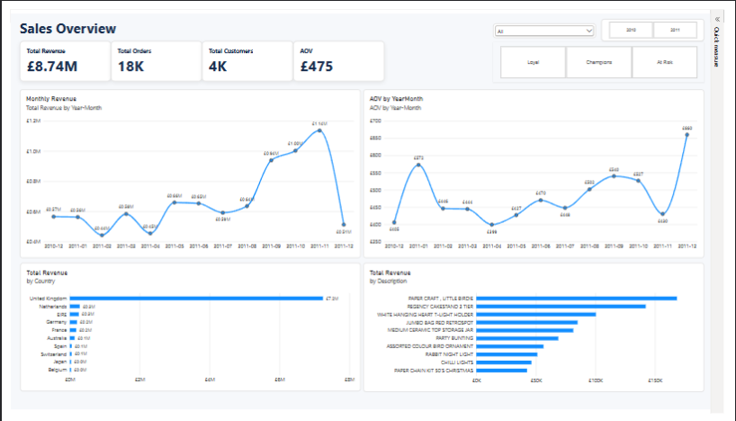
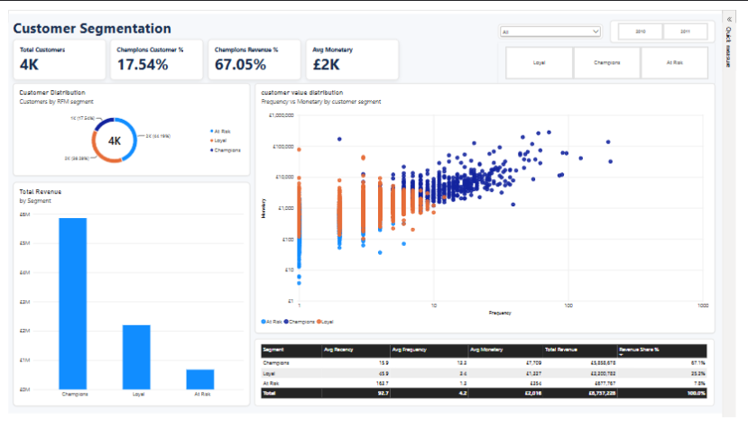
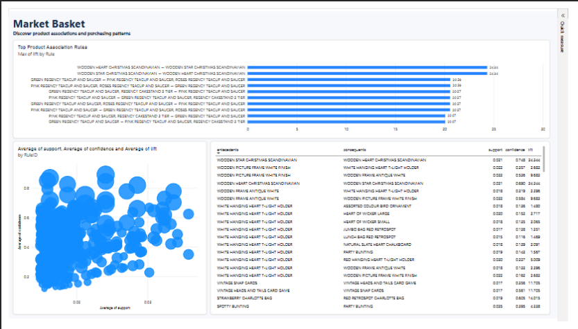

# E-Commerce Customer Analytics & Segmentation (RFM + K-Means)

 **Language / Bahasa:** [🇬🇧 English](#-english) | [🇮🇩 Bahasa Indonesia](#-bahasa-indonesia)

---

<a id="-english"></a>

# 🇬🇧 English

## 📌 Project Overview

This project analyzes ~540K rows of UK-based online retail transactions (Dec 2010 – Dec 2011) to understand sales performance, segment customers by value, and find cross-selling opportunities through product association rules.

## 🛠️ Tech Stack

- **Language:** Python 3.14
- **Libraries:** Pandas, NumPy, Scikit-Learn (K-Means), Matplotlib, Seaborn, Mlxtend (Apriori)
- **BI Tools:** Power BI and Tableau
- **Environment:** VS Code / Jupyter Notebooks

## 🚀 Key Analysis Phases

1. **Data Cleaning:** 541,909 raw rows reduced to 391,150 by removing duplicates, rows without `CustomerID`, cancelled invoices (prefix `C`), non-positive quantity/price, and non-product stock codes (postage, bank charges, fees, etc.).
2. **Exploratory Data Analysis:** Monthly revenue, Average Order Value (AOV), and revenue by country.
3. **Customer Segmentation:** RFM (Recency, Frequency, Monetary) → log transform → IQR clipping → standardization → **K-Means (k = 3)**, chosen with the Elbow and Silhouette methods. Clusters are labeled _Champions, Loyal, At Risk_ by centroid score.
4. **Market Basket Analysis:** **Apriori** on the 150 most frequent products in UK invoices (`min_support = 0.015`, `min_lift = 1.2`) to surface cross-selling rules.

## 💻 Code Preview

### 1. Data Cleaning & Preprocessing
```python
n_raw = len(df)
df = df.drop_duplicates()
df = df.dropna(subset=["CustomerID"])
df["CustomerID"] = df["CustomerID"].astype(int)

df = df[~df["InvoiceNo"].astype(str).str.startswith("C")]      # membuang transaksi yang dibatalkan
df = df[(df["Quantity"] > 0) & (df["UnitPrice"] > 0)]            # membuang qty/harga tidak valid
non_product = r"^(POST|D|M|DOT|C2|BANK CHARGES|CRUK|S|B|AMAZONFEE|PADS|gift.*)$"
df = df[~df["StockCode"].astype(str).str.match(non_product, case=False)]

df["Description"] = df["Description"].str.strip().str.upper()
df["Revenue"] = (df["Quantity"] * df["UnitPrice"]).round(2)
df["InvoiceDay"] = df["InvoiceDate"].dt.normalize()
df["YearMonth"] = df["InvoiceDate"].dt.to_period("M").astype(str)
print(f"Baris: {n_raw:,} -> {len(df):,}")
```

### 2. Exploratory Data Analysis
```python
monthly = df.groupby("YearMonth").agg(
    Revenue=("Revenue", "sum"), Orders=("InvoiceNo", "nunique"))
monthly["AOV"] = monthly["Revenue"] / monthly["Orders"]
print(monthly.round(2))

country = df.groupby("Country")["Revenue"].sum().sort_values(ascending=False)
print((country / country.sum()).head(10).round(3))

fig, ax = plt.subplots(1, 2, figsize=(14, 4))
monthly["Revenue"].plot(kind="bar", ax=ax[0], title="Monthly Revenue")
country.head(10).plot(kind="barh", ax=ax[1], title="Top 10 Country by Revenue").invert_yaxis()
plt.tight_layout(); plt.show()
```

### 3. RFM Features & K-Means Clustering
```python
# %% RFM
snapshot = df["InvoiceDate"].max() + pd.Timedelta(days=1)
rfm = df.groupby("CustomerID").agg(
    Recency=("InvoiceDate", lambda x: (snapshot - x.max()).days),
    Frequency=("InvoiceNo", "nunique"),
    Monetary=("Revenue", "sum"),
).reset_index()

feat = ["Recency", "Frequency", "Monetary"]
X = np.log1p(rfm[feat])
for c in feat:                                   # outlier treatment IQR (clipping)
    q1, q3 = X[c].quantile([0.25, 0.75])
    iqr = q3 - q1
    X[c] = X[c].clip(q1 - 1.5 * iqr, q3 + 1.5 * iqr)
Xs = StandardScaler().fit_transform(X)

# %% K-Means Clustering
ks = range(2, 9)
inertia, sil = [], []
for k in ks:
    km = KMeans(n_clusters=k, n_init=10, random_state=42).fit(Xs)
    inertia.append(km.inertia_)
    sil.append(silhouette_score(Xs, km.labels_))
fig, ax = plt.subplots(1, 2, figsize=(12, 4))
ax[0].plot(ks, inertia, marker="o"); ax[0].set_title("Elbow")
ax[1].plot(ks, sil, marker="o"); ax[1].set_title("Silhouette")
plt.show()

km = KMeans(n_clusters=3, n_init=10, random_state=42).fit(Xs)
rfm["Cluster"] = km.labels_

c = km.cluster_centers_
score = -c[:, 0] + c[:, 1] + c[:, 2]
order = np.argsort(score)[::-1]
label_map = {order[0]: "Champions", order[1]: "Loyal", order[2]: "At Risk"}
rfm["Segment"] = rfm["Cluster"].map(label_map)

seg = rfm.groupby("Segment").agg(
    Customers=("CustomerID", "count"),
    Recency=("Recency", "mean"),
    Frequency=("Frequency", "mean"),
    Monetary=("Monetary", "mean"),
    TotalRevenue=("Monetary", "sum"),
)
seg["CustomerShare"] = seg["Customers"] / seg["Customers"].sum()
seg["RevenueShare"] = seg["TotalRevenue"] / seg["TotalRevenue"].sum()
print(seg.round(3))   
```

### 4. Market Basket Analysis (Apriori)
```python
uk = df[df["Country"] == "United Kingdom"]
top_items = uk["Description"].value_counts().head(150).index
b = uk[uk["Description"].isin(top_items)]
basket = b.groupby(["InvoiceNo", "Description"])["Quantity"].sum().unstack(fill_value=0) > 0

freq = apriori(basket, min_support=0.015, use_colnames=True)
try:
    rules = association_rules(freq, num_itemsets=len(basket), metric="lift", min_threshold=1.2)
except TypeError:
    rules = association_rules(freq, metric="lift", min_threshold=1.2)

rules["antecedents"] = rules["antecedents"].apply(lambda s: ", ".join(sorted(s)))
rules["consequents"] = rules["consequents"].apply(lambda s: ", ".join(sorted(s)))
rules = rules[["antecedents", "consequents", "support", "confidence", "lift"]] \
    .sort_values("lift", ascending=False)
print(rules.head(10))
```

## 📊 Power BI Dashboard Preview

### Page 1 – Sales Overview


### Page 2 – Customer Segmentation


### Page 3 – Market Basket



## 💡 Business Insights

| Metric | Value |
| --- | --- |
| Total revenue | £8.74M |
| Total orders | ~18K |
| Total customers | ~4.3K |
| Average order value | £475 |

**Customer segments**

| Segment | Customers | Avg Recency (days) | Avg Frequency | Avg Monetary | Revenue Share |
| --- | --- | --- | --- | --- | --- |
| Champions | 760 (17.5%) | 15.9 | 13.3 | £7,709 | 67.1% |
| Loyal | 1,659 (38.3%) | 45.9 | 3.4 | £1,327 | 25.2% |
| At Risk | 1,915 (44.2%) | 163.7 | 1.3 | £354 | 7.8% |

- **Champions** are only 17.5% of customers but generate 67.1% of total revenue.
- **At Risk** customers are the largest group (44.2%) yet contribute only 7.8% of revenue, making them the main target for win-back campaigns.
- **Seasonality:** revenue rises sharply from September 2011 and peaks in November 2011 (£1.14M). The December 2011 figure is low because the dataset ends in early December (incomplete month), not because of a real drop.
- **Geography:** the United Kingdom accounts for ~83% of revenue, followed by the Netherlands, EIRE, Germany, and France.
- **Top association rules** (UK only): Wooden Heart ↔ Wooden Star Christmas Scandinavian (lift 24.3), Green ↔ Pink Regency Teacup and Saucer sets (lift ~20.6), Vintage Snap Cards ↔ Vintage Heads and Tails Card Game (lift 11.7). These are strong candidates for product bundles.

## 📂 Folder Structure

```
├── data/
│   ├── raw/data.csv                  # original dataset (not tracked)
│   └── processed/
│       ├── transactions_clean.csv    # cleaned transactions
│       ├── rfm_segments.csv          # RFM values + segment per customer
│       └── basket_rules.csv          # Apriori association rules
├── notebooks/e-commerce.ipynb        # cleaning, EDA, RFM + K-Means, Apriori
├── dashboard/                        # Power BI / Tableau screenshots and files
├── requirements.txt
└── README.md
```

## ▶️ How to Run

```bash
python -m venv .venv
source .venv/bin/activate        # Windows: .venv\Scripts\activate
pip install -r requirements.txt
```

Place the raw dataset at `data/raw/data.csv`, then run the notebook from top to bottom. Outputs are written to `data/processed/` and can be loaded into Power BI or Tableau.

## 📄 License

This project is licensed under the MIT License - see the [LICENSE](LICENSE) file for details.

[⬆ Back to top](#e-commerce-customer-analytics--segmentation-rfm--k-means)

---

<a id="-bahasa-indonesia"></a>

# 🇮🇩 Bahasa Indonesia

## 📌 Gambaran Proyek

Proyek ini menganalisis ±540 ribu baris transaksi toko online asal Inggris (Des 2010 – Des 2011) untuk memahami performa penjualan, mengelompokkan pelanggan berdasarkan nilainya, dan menemukan peluang _cross-selling_ lewat aturan asosiasi produk.

## 🛠️ Teknologi yang Digunakan

- **Bahasa:** Python 3.14
- **Library:** Pandas, NumPy, Scikit-Learn (K-Means), Matplotlib, Seaborn, Mlxtend (Apriori)
- **Alat BI:** Power BI dan Tableau
- **Lingkungan:** VS Code / Jupyter Notebook

## 🚀 Tahapan Analisis

1. **Pembersihan Data:** 541.909 baris mentah menjadi 391.150 baris setelah menghapus duplikat, baris tanpa `CustomerID`, invoice yang dibatalkan (awalan `C`), kuantitas/harga tidak valid, dan kode stok non-produk (ongkir, biaya bank, fee, dll.).
2. **Analisis Data Eksploratif (EDA):** Revenue bulanan, Average Order Value (AOV), dan revenue per negara.
3. **Segmentasi Pelanggan:** RFM (Recency, Frequency, Monetary) → transformasi log → _clipping_ IQR → standardisasi → **K-Means (k = 3)**, dipilih dengan metode Elbow dan Silhouette. Klaster diberi label _Champions, Loyal, At Risk_ berdasarkan skor centroid.
4. **Market Basket Analysis:** **Apriori** pada 150 produk paling sering muncul di invoice UK (`min_support = 0.015`, `min_lift = 1.2`) untuk menemukan aturan _cross-selling_.

## 💻 Tampilan Kode Program

### 1. Pembersihan & Pra-pemrosesan Data
```python
n_raw = len(df)
df = df.drop_duplicates()
df = df.dropna(subset=["CustomerID"])
df["CustomerID"] = df["CustomerID"].astype(int)

df = df[~df["InvoiceNo"].astype(str).str.startswith("C")]      # membuang transaksi yang dibatalkan
df = df[(df["Quantity"] > 0) & (df["UnitPrice"] > 0)]            # membuang qty/harga tidak valid
non_product = r"^(POST|D|M|DOT|C2|BANK CHARGES|CRUK|S|B|AMAZONFEE|PADS|gift.*)$"
df = df[~df["StockCode"].astype(str).str.match(non_product, case=False)]

df["Description"] = df["Description"].str.strip().str.upper()
df["Revenue"] = (df["Quantity"] * df["UnitPrice"]).round(2)
df["InvoiceDay"] = df["InvoiceDate"].dt.normalize()
df["YearMonth"] = df["InvoiceDate"].dt.to_period("M").astype(str)
print(f"Baris: {n_raw:,} -> {len(df):,}")
```

### 2. EDA
```python
monthly = df.groupby("YearMonth").agg(
    Revenue=("Revenue", "sum"), Orders=("InvoiceNo", "nunique"))
monthly["AOV"] = monthly["Revenue"] / monthly["Orders"]
print(monthly.round(2))

country = df.groupby("Country")["Revenue"].sum().sort_values(ascending=False)
print((country / country.sum()).head(10).round(3))

fig, ax = plt.subplots(1, 2, figsize=(14, 4))
monthly["Revenue"].plot(kind="bar", ax=ax[0], title="Monthly Revenue")
country.head(10).plot(kind="barh", ax=ax[1], title="Top 10 Country by Revenue").invert_yaxis()
plt.tight_layout(); plt.show()
```

### 3. RFM & Klastering menggunakan K-Means
```python
# %% RFM
snapshot = df["InvoiceDate"].max() + pd.Timedelta(days=1)
rfm = df.groupby("CustomerID").agg(
    Recency=("InvoiceDate", lambda x: (snapshot - x.max()).days),
    Frequency=("InvoiceNo", "nunique"),
    Monetary=("Revenue", "sum"),
).reset_index()

feat = ["Recency", "Frequency", "Monetary"]
X = np.log1p(rfm[feat])
for c in feat:                                   # outlier treatment IQR (clipping)
    q1, q3 = X[c].quantile([0.25, 0.75])
    iqr = q3 - q1
    X[c] = X[c].clip(q1 - 1.5 * iqr, q3 + 1.5 * iqr)
Xs = StandardScaler().fit_transform(X)

# %% K-Means Clustering
ks = range(2, 9)
inertia, sil = [], []
for k in ks:
    km = KMeans(n_clusters=k, n_init=10, random_state=42).fit(Xs)
    inertia.append(km.inertia_)
    sil.append(silhouette_score(Xs, km.labels_))
fig, ax = plt.subplots(1, 2, figsize=(12, 4))
ax[0].plot(ks, inertia, marker="o"); ax[0].set_title("Elbow")
ax[1].plot(ks, sil, marker="o"); ax[1].set_title("Silhouette")
plt.show()

km = KMeans(n_clusters=3, n_init=10, random_state=42).fit(Xs)
rfm["Cluster"] = km.labels_

c = km.cluster_centers_
score = -c[:, 0] + c[:, 1] + c[:, 2]
order = np.argsort(score)[::-1]
label_map = {order[0]: "Champions", order[1]: "Loyal", order[2]: "At Risk"}
rfm["Segment"] = rfm["Cluster"].map(label_map)

seg = rfm.groupby("Segment").agg(
    Customers=("CustomerID", "count"),
    Recency=("Recency", "mean"),
    Frequency=("Frequency", "mean"),
    Monetary=("Monetary", "mean"),
    TotalRevenue=("Monetary", "sum"),
)
seg["CustomerShare"] = seg["Customers"] / seg["Customers"].sum()
seg["RevenueShare"] = seg["TotalRevenue"] / seg["TotalRevenue"].sum()
print(seg.round(3))   
```

### 4. Market Basket Analysis (Apriori)
```python
uk = df[df["Country"] == "United Kingdom"]
top_items = uk["Description"].value_counts().head(150).index
b = uk[uk["Description"].isin(top_items)]
basket = b.groupby(["InvoiceNo", "Description"])["Quantity"].sum().unstack(fill_value=0) > 0

freq = apriori(basket, min_support=0.015, use_colnames=True)
try:
    rules = association_rules(freq, num_itemsets=len(basket), metric="lift", min_threshold=1.2)
except TypeError:
    rules = association_rules(freq, metric="lift", min_threshold=1.2)

rules["antecedents"] = rules["antecedents"].apply(lambda s: ", ".join(sorted(s)))
rules["consequents"] = rules["consequents"].apply(lambda s: ", ".join(sorted(s)))
rules = rules[["antecedents", "consequents", "support", "confidence", "lift"]] \
    .sort_values("lift", ascending=False)
print(rules.head(10))
```

## 📊 Tampilan Dashboard Power BI


### Halaman 1 – Sales Overview


### Halaman 2 – Customer Segmentation


### Halaman 3 – Market Basket


## 💡 Insight Bisnis

| Metrik | Nilai |
| --- | --- |
| Total revenue | £8,74 juta |
| Total order | ±18 ribu |
| Total pelanggan | ±4,3 ribu |
| Rata-rata nilai order (AOV) | £475 |

**Segmen pelanggan**

| Segmen | Pelanggan | Rata-rata Recency (hari) | Rata-rata Frequency | Rata-rata Monetary | Porsi Revenue |
| --- | --- | --- | --- | --- | --- |
| Champions | 760 (17,5%) | 15,9 | 13,3 | £7.709 | 67,1% |
| Loyal | 1.659 (38,3%) | 45,9 | 3,4 | £1.327 | 25,2% |
| At Risk | 1.915 (44,2%) | 163,7 | 1,3 | £354 | 7,8% |

- **Champions** hanya 17,5% dari seluruh pelanggan, tetapi menghasilkan 67,1% dari total revenue.
- **At Risk** adalah kelompok terbesar (44,2%) namun hanya menyumbang 7,8% revenue, sehingga menjadi target utama kampanye _win-back_.
- **Musiman:** revenue naik tajam sejak September 2011 dan memuncak pada November 2011 (£1,14 juta). Angka Desember 2011 rendah karena data hanya sampai awal Desember (bulan belum lengkap), bukan karena penurunan sebenarnya.
- **Geografi:** Inggris menyumbang ±83% revenue, diikuti Netherlands, EIRE, Germany, dan France.
- **Aturan asosiasi teratas** (khusus UK): Wooden Heart ↔ Wooden Star Christmas Scandinavian (lift 24,3), set Green ↔ Pink Regency Teacup and Saucer (lift ±20,6), Vintage Snap Cards ↔ Vintage Heads and Tails Card Game (lift 11,7). Pasangan ini cocok dijadikan paket bundling produk.

## 📂 Struktur Folder

```
├── data/
│   ├── raw/data.csv                  # dataset asli (tidak di-track)
│   └── processed/
│       ├── transactions_clean.csv    # transaksi yang sudah dibersihkan
│       ├── rfm_segments.csv          # nilai RFM + segmen tiap pelanggan
│       └── basket_rules.csv          # aturan asosiasi hasil Apriori
├── notebooks/e-commerce.ipynb        # pembersihan, EDA, RFM + K-Means, Apriori
├── dashboard/                        # screenshot dan file Power BI / Tableau
├── requirements.txt
└── README.md
```

## ▶️ Cara Menjalankan

```bash
python -m venv .venv
source .venv/bin/activate        # Windows: .venv\Scripts\activate
pip install -r requirements.txt
```

Letakkan dataset mentah di `data/raw/data.csv`, lalu jalankan notebook dari atas sampai bawah. Hasilnya tersimpan di `data/processed/` dan dapat dimuat ke Power BI atau Tableau.

## 📄 Lisensi

Proyek ini dilisensikan di bawah MIT License - lihat file [LICENSE](LICENSE) untuk detailnya.

[⬆ Kembali ke atas](#e-commerce-customer-analytics--segmentation-rfm--k-means)

# Full Analysis Report / Laporan Analisis Lengkap

🌐 [🇬🇧 English](#-english) | [🇮🇩 Bahasa Indonesia](#-bahasa-indonesia)

---

<a id="-english"></a>

# 🇬🇧 English

## 1. Objective

The goal is to turn raw online-retail transactions into three kinds of business answers:

1. **How is the business performing over time and across markets?** (revenue, orders, AOV, country mix)
2. **Who are the valuable customers, and who is slipping away?** (RFM + K-Means segmentation)
3. **Which products are bought together?** (market basket analysis with Apriori)

Source notebook: `notebooks/e-commerce.ipynb`. Dashboards: Power BI (3 pages) and Tableau.

## 2. Data

| Item | Value |
| --- | --- |
| Raw size | 541,909 rows × 8 columns |
| Columns | `InvoiceNo`, `StockCode`, `Description`, `Quantity`, `InvoiceDate`, `UnitPrice`, `CustomerID`, `Country` |
| Period | December 2010 – December 2011 |
| Missing values | `Description`: 1,454 · `CustomerID`: 135,080 (~25% of rows) |

The file is read with `ISO-8859-1` encoding and `InvoiceDate` is parsed as `%m/%d/%Y %H:%M`.

## 3. Data Cleaning

Steps applied in order:

1. **Drop exact duplicate rows.**
2. **Drop rows without `CustomerID`** (RFM needs a customer identity), then cast the ID to integer.
3. **Remove cancelled invoices** – invoice numbers starting with `C`.
4. **Remove invalid rows** – `Quantity ≤ 0` or `UnitPrice ≤ 0`.
5. **Remove non-product stock codes** – postage (`POST`), discounts (`D`), manual (`M`), `DOT`, `C2`, `BANK CHARGES`, `CRUK`, `S`, `B`, `AMAZONFEE`, `PADS`, and any `gift*` code. These are fees or adjustments, not merchandise, and would distort revenue and basket analysis.
6. **Standardize text** – trim and upper-case `Description`.
7. **Create features** – `Revenue = Quantity × UnitPrice`, `InvoiceDay`, and `YearMonth`.

**Result: 541,909 → 391,150 rows (≈ 28% removed).** Most of the loss comes from rows without a customer ID, which means the final revenue (£8.74M) covers identified customers only and understates the shop's true total.

## 4. Exploratory Data Analysis

### 4.1 Monthly revenue, orders and AOV

AOV = monthly revenue ÷ unique invoices.

| Month | Revenue (£) | Orders | AOV (£) |
| --- | --- | --- | --- |
| 2010-12 | 565,200 | 1,394 | 405 |
| 2011-01 | 562,683 | 983 | 572 |
| 2011-02 | 442,294 | 992 | 446 |
| 2011-03 | 583,144 | 1,312 | 444 |
| 2011-04 | 454,441 | 1,139 | 399 |
| 2011-05 | 659,242 | 1,544 | 427 |
| 2011-06 | 653,265 | 1,390 | 470 |
| 2011-07 | 591,604 | 1,321 | 448 |
| 2011-08 | 635,514 | 1,267 | 502 |
| 2011-09 | 938,753 | 1,739 | 540 |
| 2011-10 | 1,002,327 | 1,903 | 527 |
| 2011-11 | 1,136,534 | 2,642 | 430 |
| 2011-12 | 512,228 | 776 | 660 |

**What it shows**

- **Flat first half, strong second half.** From December 2010 to August 2011 monthly revenue stays between £0.44M and £0.66M, with a low in February (£0.44M).
- **Q4 ramp-up.** September–November 2011 delivers about £3.08M, roughly **35% of all revenue in three months**. November is the peak (£1.14M, 2,642 orders), about 79% above August.
- **The November peak is volume-driven.** Orders jump to 2,642 while AOV actually dips to £430, so more customers bought rather than each customer spending more. In September–October both orders and AOV were higher.
- **December 2011 is incomplete.** Only 776 orders appear, so the low revenue (£0.51M) and the very high AOV (£660) should not be interpreted as a real trend.

### 4.2 Revenue by country

| Country | Share of revenue |
| --- | --- |
| United Kingdom | 82.9% |
| Netherlands | 3.2% |
| EIRE | 2.9% |
| Germany | 2.4% |
| France | 2.1% |
| Australia | 1.6% |
| Spain / Switzerland | 0.6% each |
| Japan / Belgium | 0.4% each |

The business is heavily UK-centric. The next nine countries together contribute less than a fifth of revenue, which is why the market basket analysis is restricted to UK invoices.

### 4.3 Top products (Power BI)

By revenue the leaders are *Paper Craft, Little Birdie*, *Regency Cakestand 3 Tier* and *White Hanging Heart T-Light Holder*, followed by storage jars, bags, party items and seasonal decorations.

## 5. Customer Segmentation (RFM + K-Means)

### 5.1 Building RFM

Snapshot date = last invoice date + 1 day. For each customer:

- **Recency** – days since the last purchase (lower is better).
- **Frequency** – number of unique invoices.
- **Monetary** – total revenue.

### 5.2 Preparing the features

1. `log1p` transform – RFM variables are strongly right-skewed (a few customers buy a lot); the log makes distances more meaningful.
2. **IQR clipping** (1.5 × IQR) on the log values – caps extreme outliers so they do not dominate the clusters. Clipping is applied only to the model input; the reported segment averages use the original RFM values.
3. `StandardScaler` – puts R, F and M on the same scale for K-Means.

### 5.3 Choosing k

K-Means (`n_init=10`, `random_state=42`) was run for k = 2…8 and compared with the **Elbow** (inertia) and **Silhouette** plots. **k = 3** was selected because it gives a clear, actionable split (best / middle / worst customers) while staying easy to explain to the business.

### 5.4 Naming the clusters

Each centroid receives a score `−Recency + Frequency + Monetary` (in standardized units). The highest score is labeled **Champions**, the middle **Loyal**, and the lowest **At Risk**.

### 5.5 Results

| Segment | Customers | Share of customers | Avg Recency (days) | Avg Frequency | Avg Monetary (£) | Total revenue (£) | Share of revenue |
| --- | --- | --- | --- | --- | --- | --- | --- |
| Champions | 760 | 17.5% | 15.9 | 13.3 | 7,709 | 5,858,678 | **67.1%** |
| Loyal | 1,659 | 38.3% | 45.9 | 3.4 | 1,327 | 2,200,782 | 25.2% |
| At Risk | 1,915 | 44.2% | 163.7 | 1.3 | 354 | 677,767 | 7.8% |
| **Total** | **4,334** | 100% | 92.7 | 4.2 | 2,016 | 8,737,228 | 100% |

**Interpretation**

- **Champions** buy about every two weeks on average (recency ≈ 16 days, ~13 orders). A typical Champion is worth ≈ 22× an At Risk customer (£7,709 vs £354). Losing even a few of them would hurt noticeably.
- **Loyal** customers are a solid middle: ~3 orders, last seen ~6–7 weeks ago, and they hold 25% of revenue. They are the best pool for *upgrading* into Champions.
- **At Risk** customers are the biggest group but mostly bought once (frequency ≈ 1.3) and have been inactive for about 5½ months. Their combined value is small (7.8%), so campaigns should be low-cost.

The scatter plot (frequency vs monetary, log scales) confirms this: Champions sit in the top-right, Loyal in the middle band, and At Risk at frequency 1 with low spend.

## 6. Market Basket Analysis (Apriori)

### 6.1 Setup

- Only **UK** invoices are used (the largest, most homogeneous market).
- Only the **150 most frequent products** are kept to limit sparsity and runtime.
- A basket table is built (rows = invoices, columns = products, values = bought or not).
- Apriori with `min_support = 0.015` (an itemset must appear in at least 1.5% of invoices).
- Rules are filtered with `lift ≥ 1.2` and sorted by lift. The code handles both old and new `mlxtend` versions of `association_rules`.

### 6.2 Metrics in plain words

- **Support** – how often the combination appears across all baskets.
- **Confidence** – given the antecedent is in the basket, how often the consequent is too.
- **Lift** – how much more likely the pair is than by chance. Lift > 1 means a positive association; 20 means 20× more likely than random.

### 6.3 Key findings

| Rule | Support | Confidence | Lift |
| --- | --- | --- | --- |
| Wooden Heart Christmas Scandinavian ↔ Wooden Star Christmas Scandinavian | 0.021 | 0.69 / 0.75 | **24.3** |
| Green Regency Teacup and Saucer → Pink + Roses Regency Teacup and Saucer | 0.024 | 0.56 | 20.6 |
| Pink + Roses Regency Teacup and Saucer → Green Regency Teacup and Saucer | 0.024 | 0.89 | 20.6 |
| Strawberry Charlotte Bag → Red Retrospot Charlotte Bag | 0.019 | 0.61 | 14.0 |
| Vintage Snap Cards ↔ Vintage Heads and Tails Card Game | 0.017 | 0.36 / 0.56 | 11.7 |
| Wooden Picture Frame White Finish ↔ Wooden Frame Antique White | 0.032 | 0.54 / 0.58 | 9.7 |
| White Hanging Heart T-Light Holder → Red Hanging Heart T-Light Holder | 0.030 | 0.23 | 5.0 |
| Spotty Bunting → Party Bunting | 0.025 | 0.40 | 4.3 |

**Interpretation**

- The strongest rules are **matching sets and colour/style variants** of the same product family (teacup colours, Christmas ornaments, bag designs, picture frames). Customers collect the whole range.
- The same pair appears in both directions with different confidence – use the direction with higher confidence for recommendations (e.g., a Pink + Roses teacup buyer is 89% likely to also buy the Green one).
- Rules with the best-selling item *White Hanging Heart T-Light Holder* as antecedent have modest lift (1.3–5.0) but high volume, making them useful for broad "frequently bought together" suggestions.

**Caution:** association is not causation, and many high-lift rules are near-identical items, so they are best used for bundles and on-page recommendations rather than as proof that one item drives sales of another.

## 7. Business Recommendations

1. **Protect Champions (17.5% of customers, 67% of revenue).** VIP program, early access to new ranges, dedicated service; monitor recency and flag anyone whose gap grows.
2. **Upgrade Loyal customers.** Use bundles and "complete the set" offers (see section 6) and reorder reminders to lift frequency.
3. **Win back At Risk customers cheaply.** Automated email flows and a single targeted offer; do not over-invest, since the whole segment is worth 7.8% of revenue.
4. **Prepare for Q4.** Build stock and staffing from September; revenue in Sep–Nov is about a third of the year.
5. **Create bundles from top rules.** Teacup sets, Christmas ornament pairs, card-game pairs, matching frames and bags.
6. **Test international growth carefully.** Non-UK markets are small; run low-risk pilots (e.g., Netherlands, EIRE, Germany).

## 8. Limitations

- **Incomplete December 2011** – use full months only when judging trends.
- **~25% of rows have no `CustomerID`** and are excluded from RFM and revenue totals.
- **Single snapshot** – segments describe the dataset period; they should be refreshed regularly.
- **k = 3 is a business-driven choice** – other values of k may split customers more finely.
- **Basket analysis uses UK data and the top 150 products only**, so niche items and other countries are not covered.
- **Large average order values** suggest that many buyers may be businesses (wholesale), which affects how Monetary values should be read.

## 9. Output Files

| File | Content |
| --- | --- |
| `data/processed/transactions_clean.csv` | Cleaned transaction lines with `Revenue`, `InvoiceDay` |
| `data/processed/rfm_segments.csv` | `CustomerID`, Recency, Frequency, Monetary, Segment |
| `data/processed/basket_rules.csv` | Antecedents, consequents, support, confidence, lift |

These three files feed the Power BI pages *Sales Overview*, *Customer Segmentation* and *Market Basket*.

[⬆ Back to top](#full-analysis-report--laporan-analisis-lengkap)

---

<a id="-bahasa-indonesia"></a>

# 🇮🇩 Bahasa Indonesia

## 1. Tujuan

Tujuannya mengubah data transaksi toko online mentah menjadi tiga jenis jawaban bisnis:

1. **Bagaimana performa bisnis dari waktu ke waktu dan antar pasar?** (revenue, order, AOV, komposisi negara)
2. **Siapa pelanggan bernilai tinggi, dan siapa yang mulai pergi?** (segmentasi RFM + K-Means)
3. **Produk apa yang sering dibeli bersamaan?** (market basket analysis dengan Apriori)

Notebook sumber: `notebooks/e-commerce.ipynb`. Dashboard: Power BI (3 halaman) dan Tableau.

## 2. Data

| Item | Nilai |
| --- | --- |
| Ukuran mentah | 541.909 baris × 8 kolom |
| Kolom | `InvoiceNo`, `StockCode`, `Description`, `Quantity`, `InvoiceDate`, `UnitPrice`, `CustomerID`, `Country` |
| Periode | Desember 2010 – Desember 2011 |
| Data kosong | `Description`: 1.454 · `CustomerID`: 135.080 (±25% baris) |

File dibaca dengan encoding `ISO-8859-1` dan `InvoiceDate` di-parse dengan format `%m/%d/%Y %H:%M`.

## 3. Pembersihan Data

Langkah yang dilakukan berurutan:

1. **Hapus baris duplikat persis.**
2. **Hapus baris tanpa `CustomerID`** (RFM butuh identitas pelanggan), lalu ubah ID menjadi integer.
3. **Hapus invoice yang dibatalkan** – nomor invoice berawalan `C`.
4. **Hapus baris tidak valid** – `Quantity ≤ 0` atau `UnitPrice ≤ 0`.
5. **Hapus kode stok non-produk** – ongkir (`POST`), diskon (`D`), manual (`M`), `DOT`, `C2`, `BANK CHARGES`, `CRUK`, `S`, `B`, `AMAZONFEE`, `PADS`, dan kode `gift*`. Ini adalah biaya atau penyesuaian, bukan barang dagangan, dan akan mengacaukan revenue serta analisis keranjang.
6. **Standarisasi teks** – hapus spasi berlebih dan ubah `Description` menjadi huruf kapital.
7. **Buat fitur baru** – `Revenue = Quantity × UnitPrice`, `InvoiceDay`, dan `YearMonth`.

**Hasil: 541.909 → 391.150 baris (≈ 28% dibuang).** Sebagian besar baris yang hilang adalah baris tanpa ID pelanggan. Artinya revenue akhir (£8,74 juta) hanya mencakup pelanggan yang teridentifikasi dan lebih kecil dari total sebenarnya.

## 4. Analisis Data Eksploratif (EDA)

### 4.1 Revenue, order, dan AOV bulanan

AOV = revenue bulanan ÷ jumlah invoice unik.

| Bulan | Revenue (£) | Order | AOV (£) |
| --- | --- | --- | --- |
| 2010-12 | 565.200 | 1.394 | 405 |
| 2011-01 | 562.683 | 983 | 572 |
| 2011-02 | 442.294 | 992 | 446 |
| 2011-03 | 583.144 | 1.312 | 444 |
| 2011-04 | 454.441 | 1.139 | 399 |
| 2011-05 | 659.242 | 1.544 | 427 |
| 2011-06 | 653.265 | 1.390 | 470 |
| 2011-07 | 591.604 | 1.321 | 448 |
| 2011-08 | 635.514 | 1.267 | 502 |
| 2011-09 | 938.753 | 1.739 | 540 |
| 2011-10 | 1.002.327 | 1.903 | 527 |
| 2011-11 | 1.136.534 | 2.642 | 430 |
| 2011-12 | 512.228 | 776 | 660 |

**Temuan**

- **Semester pertama datar, semester kedua kuat.** Dari Desember 2010 sampai Agustus 2011 revenue bulanan berada di £0,44–0,66 juta, dengan titik terendah di Februari (£0,44 juta).
- **Lonjakan Q4.** September–November 2011 menghasilkan sekitar £3,08 juta, kira-kira **35% dari seluruh revenue hanya dalam tiga bulan**. November adalah puncaknya (£1,14 juta, 2.642 order), sekitar 79% di atas Agustus.
- **Puncak November didorong volume.** Order melonjak ke 2.642 sementara AOV justru turun ke £430, artinya lebih banyak pelanggan yang membeli, bukan tiap pelanggan belanja lebih besar. Pada September–Oktober, order dan AOV sama-sama lebih tinggi.
- **Desember 2011 belum lengkap.** Hanya ada 776 order, jadi revenue rendah (£0,51 juta) dan AOV sangat tinggi (£660) tidak boleh dibaca sebagai tren nyata.

### 4.2 Revenue per negara

| Negara | Porsi revenue |
| --- | --- |
| United Kingdom | 82,9% |
| Netherlands | 3,2% |
| EIRE | 2,9% |
| Germany | 2,4% |
| France | 2,1% |
| Australia | 1,6% |
| Spain / Switzerland | masing-masing 0,6% |
| Japan / Belgium | masing-masing 0,4% |

Bisnis ini sangat bergantung pada pasar Inggris. Sembilan negara berikutnya jika digabung menyumbang kurang dari seperlima revenue, sehingga market basket analysis dibatasi pada invoice UK.

### 4.3 Produk teratas (Power BI)

Berdasarkan revenue, pemimpinnya adalah *Paper Craft, Little Birdie*, *Regency Cakestand 3 Tier*, dan *White Hanging Heart T-Light Holder*, disusul toples penyimpanan, tas, perlengkapan pesta, dan dekorasi musiman.

## 5. Segmentasi Pelanggan (RFM + K-Means)

### 5.1 Membangun RFM

Tanggal acuan (snapshot) = tanggal invoice terakhir + 1 hari. Untuk tiap pelanggan:

- **Recency** – jumlah hari sejak pembelian terakhir (makin kecil makin baik).
- **Frequency** – jumlah invoice unik.
- **Monetary** – total revenue.

### 5.2 Menyiapkan fitur

1. Transformasi `log1p` – variabel RFM sangat condong ke kanan (sedikit pelanggan belanja sangat banyak); log membuat jarak antar pelanggan lebih bermakna.
2. **Clipping IQR** (1,5 × IQR) pada nilai log – membatasi outlier ekstrem agar tidak mendominasi klaster. Clipping hanya diterapkan pada input model; rata-rata segmen yang dilaporkan memakai nilai RFM asli.
3. `StandardScaler` – menyamakan skala R, F, dan M untuk K-Means.

### 5.3 Memilih k

K-Means (`n_init=10`, `random_state=42`) dijalankan untuk k = 2…8 dan dibandingkan dengan plot **Elbow** (inertia) dan **Silhouette**. **k = 3** dipilih karena menghasilkan pembagian yang jelas dan bisa ditindaklanjuti (pelanggan terbaik / menengah / terburuk) serta mudah dijelaskan ke tim bisnis.

### 5.4 Memberi nama klaster

Setiap centroid diberi skor `−Recency + Frequency + Monetary` (dalam satuan terstandarisasi). Skor tertinggi diberi label **Champions**, tengah **Loyal**, dan terendah **At Risk**.

### 5.5 Hasil

| Segmen | Pelanggan | Porsi pelanggan | Rata-rata Recency (hari) | Rata-rata Frequency | Rata-rata Monetary (£) | Total revenue (£) | Porsi revenue |
| --- | --- | --- | --- | --- | --- | --- | --- |
| Champions | 760 | 17,5% | 15,9 | 13,3 | 7.709 | 5.858.678 | **67,1%** |
| Loyal | 1.659 | 38,3% | 45,9 | 3,4 | 1.327 | 2.200.782 | 25,2% |
| At Risk | 1.915 | 44,2% | 163,7 | 1,3 | 354 | 677.767 | 7,8% |
| **Total** | **4.334** | 100% | 92,7 | 4,2 | 2.016 | 8.737.228 | 100% |

**Interpretasi**

- **Champions** rata-rata membeli sekitar tiap dua minggu (recency ≈ 16 hari, ~13 order). Satu Champion bernilai ≈ 22× pelanggan At Risk (£7.709 vs £354). Kehilangan beberapa saja akan terasa dampaknya.
- **Loyal** adalah kelompok tengah yang solid: ~3 order, terakhir terlihat ~6–7 minggu lalu, dan memegang 25% revenue. Mereka adalah kandidat terbaik untuk *dinaikkan* menjadi Champions.
- **At Risk** adalah kelompok terbesar tetapi kebanyakan hanya membeli sekali (frequency ≈ 1,3) dan tidak aktif sekitar 5,5 bulan. Nilai totalnya kecil (7,8%), sehingga kampanyenya sebaiknya berbiaya rendah.

Scatter plot (frequency vs monetary, skala log) mendukung hal ini: Champions di kanan atas, Loyal di pita tengah, dan At Risk di frekuensi 1 dengan belanja rendah.

## 6. Market Basket Analysis (Apriori)

### 6.1 Pengaturan

- Hanya invoice **UK** yang dipakai (pasar terbesar dan paling homogen).
- Hanya **150 produk paling sering muncul** yang dipertahankan untuk membatasi sparsity dan waktu proses.
- Dibuat tabel keranjang (baris = invoice, kolom = produk, nilai = dibeli atau tidak).
- Apriori dengan `min_support = 0.015` (itemset harus muncul di minimal 1,5% invoice).
- Rule disaring dengan `lift ≥ 1,2` dan diurutkan berdasarkan lift. Kode menangani versi lama dan baru `association_rules` di `mlxtend`.

### 6.2 Metrik dengan bahasa sederhana

- **Support** – seberapa sering kombinasi muncul dari seluruh keranjang.
- **Confidence** – jika antecedent ada di keranjang, seberapa sering consequent juga ada.
- **Lift** – seberapa lebih mungkin pasangan itu muncul dibanding kebetulan. Lift > 1 berarti asosiasi positif; 20 berarti 20× lebih mungkin daripada acak.

### 6.3 Temuan utama

| Rule | Support | Confidence | Lift |
| --- | --- | --- | --- |
| Wooden Heart Christmas Scandinavian ↔ Wooden Star Christmas Scandinavian | 0,021 | 0,69 / 0,75 | **24,3** |
| Green Regency Teacup and Saucer → Pink + Roses Regency Teacup and Saucer | 0,024 | 0,56 | 20,6 |
| Pink + Roses Regency Teacup and Saucer → Green Regency Teacup and Saucer | 0,024 | 0,89 | 20,6 |
| Strawberry Charlotte Bag → Red Retrospot Charlotte Bag | 0,019 | 0,61 | 14,0 |
| Vintage Snap Cards ↔ Vintage Heads and Tails Card Game | 0,017 | 0,36 / 0,56 | 11,7 |
| Wooden Picture Frame White Finish ↔ Wooden Frame Antique White | 0,032 | 0,54 / 0,58 | 9,7 |
| White Hanging Heart T-Light Holder → Red Hanging Heart T-Light Holder | 0,030 | 0,23 | 5,0 |
| Spotty Bunting → Party Bunting | 0,025 | 0,40 | 4,3 |

**Interpretasi**

- Rule terkuat adalah **set pelengkap dan varian warna/gaya** dari keluarga produk yang sama (warna cangkir teh, ornamen Natal, desain tas, bingkai foto). Pelanggan mengoleksi seluruh rangkaiannya.
- Pasangan yang sama muncul dua arah dengan confidence berbeda – gunakan arah dengan confidence lebih tinggi untuk rekomendasi (misalnya pembeli cangkir Pink + Roses punya peluang 89% membeli yang Green juga).
- Rule dengan produk terlaris *White Hanging Heart T-Light Holder* sebagai antecedent punya lift moderat (1,3–5,0) tetapi volume tinggi, cocok untuk saran umum "sering dibeli bersama".

**Catatan:** asosiasi bukan sebab-akibat, dan banyak rule dengan lift tinggi adalah barang yang hampir identik, jadi paling tepat dipakai untuk bundling dan rekomendasi di halaman produk, bukan sebagai bukti bahwa satu produk mendorong penjualan produk lain.

## 7. Rekomendasi Bisnis

1. **Pertahankan Champions (17,5% pelanggan, 67% revenue).** Program VIP, akses awal ke koleksi baru, layanan khusus; pantau recency dan tandai pelanggan yang jeda belinya makin panjang.
2. **Naikkan kelas pelanggan Loyal.** Gunakan bundling dan penawaran "lengkapi set" (lihat bagian 6) serta pengingat pembelian ulang untuk menaikkan frekuensi.
3. **Rebut kembali At Risk dengan biaya rendah.** Alur email otomatis dan satu penawaran terarah; jangan berinvestasi berlebihan karena seluruh segmen hanya bernilai 7,8% revenue.
4. **Siapkan Q4.** Bangun stok dan tenaga kerja sejak September; revenue September–November kira-kira sepertiga setahun.
5. **Buat bundle dari rule teratas.** Set cangkir teh, pasangan ornamen Natal, pasangan permainan kartu, bingkai dan tas yang serasi.
6. **Uji ekspansi internasional dengan hati-hati.** Pasar non-UK kecil; jalankan pilot berisiko rendah (misalnya Netherlands, EIRE, Germany).

## 8. Keterbatasan

- **Desember 2011 belum lengkap** – gunakan bulan penuh saja untuk menilai tren.
- **±25% baris tanpa `CustomerID`** dan tidak masuk ke RFM maupun total revenue.
- **Satu snapshot** – segmen menggambarkan periode data; perlu diperbarui secara berkala.
- **k = 3 adalah pilihan berbasis kebutuhan bisnis** – nilai k lain bisa membagi pelanggan lebih rinci.
- **Analisis keranjang hanya memakai data UK dan 150 produk teratas**, sehingga produk niche dan negara lain tidak tercakup.
- **Nilai order rata-rata yang besar** menunjukkan banyak pembeli mungkin berupa bisnis (grosir), yang memengaruhi cara membaca nilai Monetary.

## 9. File Output

| File | Isi |
| --- | --- |
| `data/processed/transactions_clean.csv` | Baris transaksi bersih beserta `Revenue`, `InvoiceDay` |
| `data/processed/rfm_segments.csv` | `CustomerID`, Recency, Frequency, Monetary, Segment |
| `data/processed/basket_rules.csv` | Antecedents, consequents, support, confidence, lift |

Ketiga file ini menjadi sumber halaman Power BI *Sales Overview*, *Customer Segmentation*, dan *Market Basket*.

[⬆ Kembali ke atas](#full-analysis-report--laporan-analisis-lengkap)