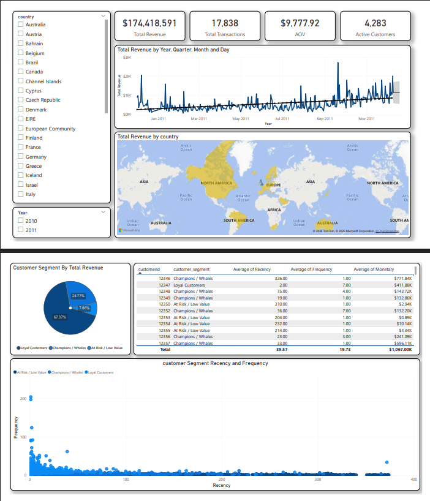
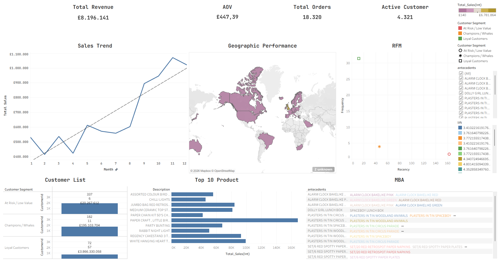

# E-Commerce Customer Analytics & Segmentation (RFM + K-Means)

## Preview Dashboard PowerBI

## Preview Dashboard Tableau

## 📌 Project Overview

This project performs an in-depth analysis of e-commerce transaction data to identify customer behavior, sales effectiveness, and strategic marketing opportunities through customer segmentation and product association analysis.

## 🛠️ Tech Stack

- **Language:** Python 3.14.2
- **Libraries:** Pandas, NumPy, Scikit-Learn (K-Means), Matplotlib, Seaborn, Mlxtend (Apriori).
- **BI Tools:** Power BI and Tableau.
- **Environment:** VS Code / Jupyter Notebooks.

## 🚀 Key Analysis Phases

1. **Data Preprocessing:** Handling missing values, removing duplicates, and treating statistical outliers using IQR methods.
2. **Exploratory Data Analysis (EDA):** Analyzing Monthly Revenue trends, Average Order Value (AOV), and Geographical market performance.
3. **Customer Segmentation:** Implementing an RFM (Recency, Frequency, Monetary) model combined with **K-Means Clustering** to segment customers into actionable categories: _Champions, Loyal, and At Risk_.
4. **Market Basket Analysis:** Utilizing the **Apriori Algorithm** to uncover product association rules and identify _cross-selling_ opportunities.

## 📊 Business Insights

- Identified the "Champions" segment, which contributes X% of total revenue despite being a minority in customer count.
- Discovered high-affinity product bundles with _Lift_ scores > 1.2, providing data-driven recommendations for marketing campaigns.
- Detected a significant seasonal revenue spike in Q4, primarily driven by the UK market.

## 📂 Folder Structure

- `/data`: Contains raw and processed datasets.
- `/notebooks`: Comprehensive Jupyter Notebooks for data cleaning and modeling.
- `/dashboards`: Visual reports (Screenshots, .pbix files, or Tableau workbook links).
- `README.md`: Project documentation and summary. "I haven't done any project documentation yet, but I will try."

## 📄 License

This project is licensed under the MIT License - see the [LICENSE](LICENSE) file for details.
